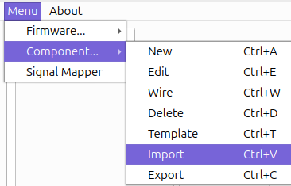

<!-- HEADER -->
 
 
 

  

  <h3 align="center">
    The essential security auditing tool for Internet of Things devices you'll need in your toolbox </h3>
     
     
    

  

   
  

    

  

   

<!-- TABLE OF CONTENTS -->

  <h2>Table of contents</h2>
    <ol>
      <li>
        <a href="#about">About the project</a>
      </li>
      <li>
        <a href="#getting-started">Getting Started</a>
        <ul>
          <li><a href="#prerequisites">Prerequisites</a></li>
          <li><a href="#installation">Installation</a></li>
        </ul>
      </li>
      <li>
        <a href="#create-your-project">Create your own Hardsploit project</a>
        <ul>
          <li><a href="#ihg">Install the Harsploit API</a></li>
          <li><a href="#iha">Install the Harsploit GUI</a></li>
          <li><a href="#sh">Start Harsploit</a></li>
        </ul>
      </li>
      <li><a href="#migration">Migration guide</a></li>
      <li><a href="#tech-used">Technologies used</a></li>
      <li><a href="#license">License</a></li>
    </ol>

  

<!-- ABOUT THE PROJECT -->

  <table>
    <tr>
      <td>
        <h2>About the project</h2>
        
Hardsploit is an innovative hardware security testing platform designed to aid security researchers, engineers, and auditors in analyzing and evaluating the security of hardware devices.

        
Featuring a modular design, Hardsploit supports various interfaces like JTAG, SPI, I2C, and UART, allowing for extensive hardware testing and reverse engineering.

        

        

          

            <h4>Main security audit functions:</h4>
            <ul>
              <li><Strong>Sniffer</Strong> (Real-time communication monitoring)</li>
              <li><Strong>Scanner</Strong> (Automatic detection of JTAG, SPI, I2C, and UART interfaces on target devices.)</li>
              <li><Strong>Injection</Strong> (Data injection to test device responses.)</li>
              <li><Strong>Memory dumping</Strong> (Extracting the contents of a chip memory)</li>
              <li><Strong>...</Strong></li>
            </ul>
            <h4>Features:</h4>
            <ul>
              <li><Strong>Advanced Firmware Analysis:</Strong> Detects and analyzes vulnerabilities in firmware.</li>
              <li><Strong>Hardware Exploit Tools:</Strong> Tools to exploit detected vulnerabilities.</li>
              <li><Strong>Secure Firmware Update:</Strong> Updates firmware while ensuring security and integrity.</li>
              <li><Strong>Enhanced User Interface:</Strong> More intuitive and interactive interface.</li>
              <li><Strong>...</Strong></li>
            </ul>
            <h4>Supported communication protocols:</h4>
            <ul>
              <li><Strong>UART</Strong> (Universal Asynchronous Receiver-Transmitter)</li>
              <li><Strong>SPI</Strong> (Serial Peripheral Interface)</li>
              <li><Strong>I2C</Strong> (Inter-Integrated Circuit)</li>
              <li><Strong>JTAG</Strong> (Joint Test Action Group)</li>
              <li><Strong>SWD</Strong> (Serial Wire Debug)</li>
              <li><Strong>NRF24L01 (Work in progress)</Strong></li>
              <li><Strong>...</Strong></li>
            </ul>
          

           
          

            

          

        

      </td>
    </tr>
  </table>

  

<!-- GETTING STARTED -->

  <h2>Getting Started</h2>
  
This guide will help you quickly get started with Hardsploit, covering the necessary prerequisites and installation steps.

  
  <h3>Pre-requisites</h3>
  
 To be able to start using Hardsploit, make sure that you have the following prerequisites installed:

  <ul>
    <li>Python v3.9 or later</li>
    <li>A Linux machine (tested on Ubuntu, Kali and Raspberry Pi OS)</li>
  </ul>
  
  <h3>Installation</h3>
  <ol>
    <li>
      
Install the Hardsploit GUI.

      <code>pip install hardsploit-gui</code>
    </li>
     
    <li>
      
That's all! Now you can start hardsploit with the following command.

      <code>harsploit</code>
    </li>
  </ol>
   
  
  <h2>Create your own Hardsploit project</h2>
  
If you want to make your Hardsploit more personal, here is the guide.

  <h3>Pre-requisites</h3>
  
 To be able to develope your project, make sure that you have the following prerequisites:

  <ul>
    <li>Python v3.9 or later</li>
    <li>A Linux machine (tested on Ubuntu, Kali, Debian and Raspberry Pi OS)</li>
    <li>A virtual environment</li>
  </ul>
  <ol>
    
    <li>
      <h3>Install the Hardsploit api!</h3>
      <ol>
        <li>
          
Clone <a href="">Hardsploit Api</a>.

          <code>git clone "https://gitlabs3.serma.com/serma_s3_iec/produits-s3/hardsploitv1-python/hardsploit-gui.git"</code>
        </li>
         
        <li>
          
Go in the cloned repository (Here, you can modifie the api)

          <code>cd "Path/To/Hardsploit</code>
        </li>
         
        <li>
          
Build the API

          <code>poetry build</code>
        </li>
         
        <li>
          
Install the API

          <code>poetry install</code>
        </li>
         
      </ol>
    </li>
    
    <li>
      <h3>Install the Hardsploit gui</h3>
      <ol>
        <li>
          
Clone <a href="">Hardsploit GUI</a>.

          <code>git clone ""</code>
        </li>
         
        <li>
          
Go in the cloned repository (Here, you can modifie the GUI)

          <code>cd Path/to/hardsploit-gui</code>
        </li>
         
        <li>
          
Build the GUI

          <code>poetry build</code>
        </li>
         
        <li>
          
Install the GUI

          <code>poetry install</code>
        </li>
      </ol>
    </li>
     
    
    <li>
      <h3>Start Hardsploit</h3>
      <code>poetry run hardsploit</code>
    </li>
  </ol>

  

<!-- MIGRATION GUIDE -->

  <h2>Migration guide</h2>
  
  <ol>
    <li>Click on the import button (or ctrl + V)</li>
    <li>Choose the old database (.sqlite3 file)</li>
    <li>Then press "Import"</li>
  </ol>
  
This import button can also be use to import saved component, commands or both. Just select a .json file

  
To save multiple components, click on the export button.

  

<!-- TECHNOLOGIES USED-->

  <h2>Technologies used</h2>
  
This project has been developed using the following technologies:

  <ul>
    <li><Strong>Python</Strong> (Programming language used for project development.)</li>
    <li><Strong>PySide6</Strong> (Python framework for developing graphical user interfaces (GUI).)</li>
    <li><Strong>Poetry</Strong> (Dependency management tool for Python projects.)</li>
    <li><Strong>Peewee</Strong> (A small, expressive ORM (Object-Relational Mapping) library for Python.)</li>
  </ul>

  

<!-- LICENSE -->

  <h2>License</h2>
  
Hardsploit is licensed under *LGPLv3*. See the <a href="http://test.fr">LICENSE</a> file for more information.

